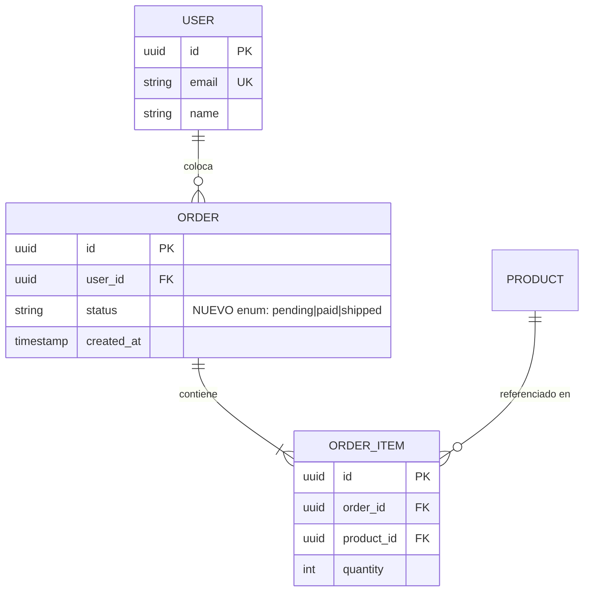

# Skill: Detalle de esquema + diagrama ER (Mermaid)

Detecta cambios en el modelo de datos y los explica con (a) el detalle de las tablas/campos
nuevos y (b) un diagrama **ER en Mermaid** del modelo afectado.

## Cuándo usar
El PR incluye migraciones (SQL, Alembic, Prisma, TypeORM, Django, ActiveRecord, Flyway,
Liquibase…), cambios en modelos ORM, o DDL directo (`CREATE TABLE`, `ALTER TABLE`, índices,
foreign keys).

## Qué extraer
- **Tablas nuevas**: nombre, propósito inferido, columnas (nombre, tipo, nullability,
  default, constraints), PK y FKs.
- **Cambios a tablas existentes**: columnas/índices/constraints agregados, modificados o
  eliminados. Marca explícitamente lo que se **elimina** (posible cambio incompatible).
- **Relaciones**: nuevas FKs y su cardinalidad.
- **Riesgos**: migraciones no reversibles, backfills, columnas `NOT NULL` sin default sobre
  tablas con datos, renombres, cambios de tipo. Señálalos.

## Salida
1. Una **tabla Markdown** por cada tabla nueva/cambiada con sus campos y tipos.
2. Un **diagrama ER** que muestre el modelo afectado (tablas nuevas + las existentes con
   las que se relacionan). Marca lo nuevo en el nombre o con un comentario.

### Plantilla del diagrama


## Reglas
- Devuelve **solo** Markdown + un bloque ```mermaid `erDiagram` válido y renderizable.
- Cardinalidad correcta en Mermaid: `||--o{` (uno a muchos, opcional), `||--|{` (uno a
  muchos, obligatorio), `}o--o{` (muchos a muchos), etc.
- Incluye en el diagrama solo las tablas afectadas y sus vecinas directas, no el esquema completo.
- Deriva tipos/constraints del código real de la migración; no los inventes. Si el tipo no
  es claro, márcalo como `?` y explica por qué.
- Da visibilidad a los **riesgos de migración**; son lo más importante para quien aprueba.
