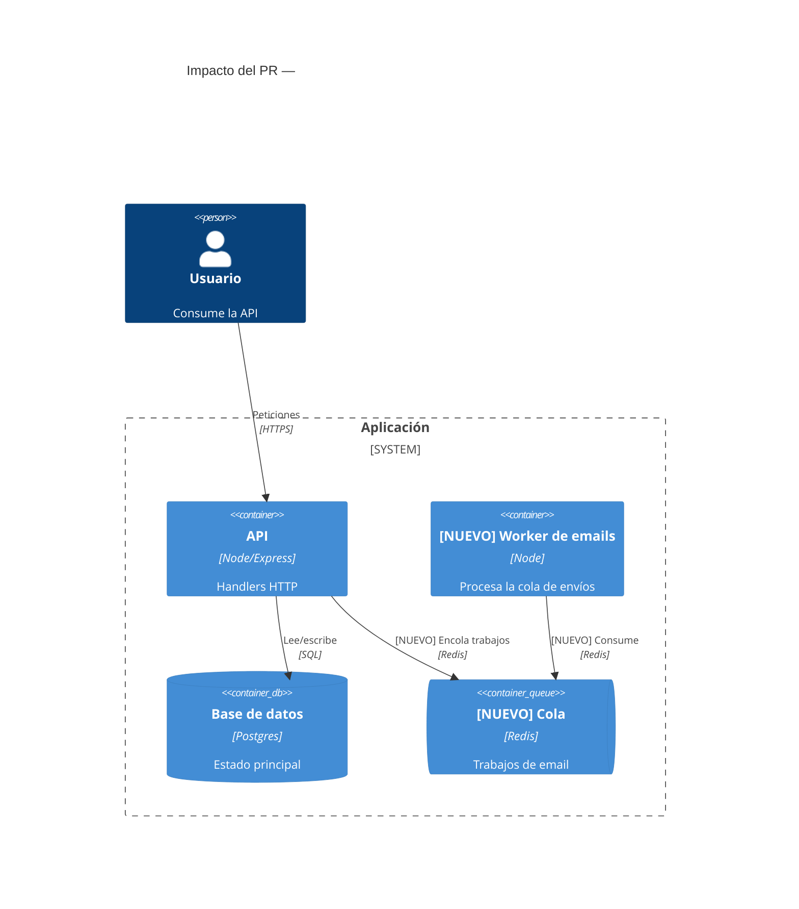

# Skill: Diagrama C4 (Mermaid) de impacto arquitectónico

Produce un diagrama **C4 en Mermaid** que muestre cómo un cambio afecta la arquitectura.

## Cuándo usar
Cuando el cambio agrega/quita un servicio o módulo, cambia dependencias entre componentes,
o altera un flujo de datos entre sistemas. Si el cambio es puramente cosmético, no uses
esta skill.

## Elegir el nivel C4
- **Contexto** (`C4Context`): el PR toca cómo el sistema interactúa con actores/sistemas externos.
- **Contenedor** (`C4Container`): el PR agrega/cambia un servicio, base de datos, cola, worker.
- **Componente** (`C4Component`): el PR cambia módulos/clases dentro de un contenedor.
Elige el nivel **más bajo** que capture el cambio; no dibujes todo el sistema, solo la vecindad afectada.

## Regla de resaltado
Marca lo nuevo/modificado explícitamente en el texto del elemento (p. ej. prefijo
`[NUEVO]` o `[MODIFICADO]` en el label) para que la UI/lector lo distinga del contexto existente.

## Plantilla (C4Container)


## Reglas de salida
- Devuelve **solo** un bloque ```mermaid válido y renderizable (más 1–2 frases de contexto si ayudan).
- Nada de sintaxis inventada: usa únicamente elementos C4 soportados por Mermaid
  (`Person`, `System`, `Container`, `ContainerDb`, `ContainerQueue`, `Component`,
  `System_Boundary`, `Container_Boundary`, `Rel`, `BiRel`, ...).
- No dibujes el sistema entero: solo la porción afectada por el PR y su vecindad inmediata.
- Si falta contexto para inferir la arquitectura, dilo y nombra el archivo que haría falta leer.
- Etiquetas de `Rel()` de máximo 4 palabras: el detalle va en la prosa que acompaña al diagrama,
  nunca en la flecha.
- Máximo 8 elementos por diagrama (personas, containers, componentes o systems). Si el cambio
  toca más, sube de nivel C4 o recorta a la vecindad realmente afectada.
- El argumento de tecnología de cada elemento es corto: una o dos palabras (p. ej. `"Node.js"`,
  no una lista de librerías).
- Nunca uses el carácter `#` dentro del diagrama (ni en `title` ni en labels): el lexer C4 de
  Mermaid lo rechaza con "Lexical error". Escribe `PR 482`, no `PR #482`.
